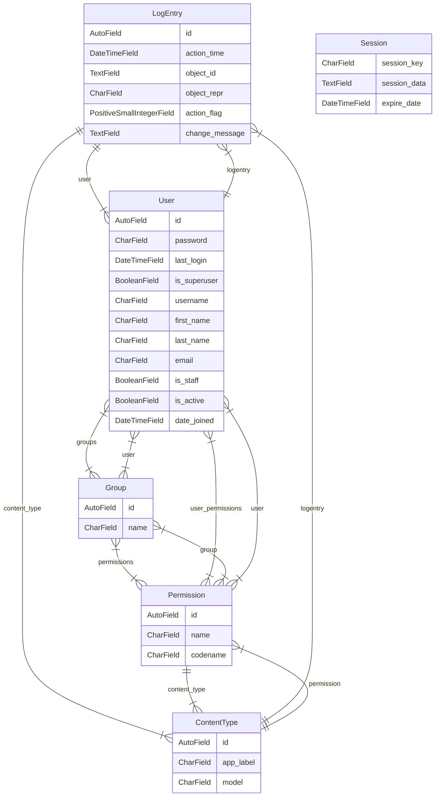

## Django Mermaid

Create ER Diagrams (Entity Relationship Diagrams) of your Django projects related to different models of associated applications in Mermaid.

Get a Markdown representation of the relationships in your Django project models with Mermaid.

```
python mermaid.py <settings_project_folder>
```

TODO:

- Create a python/django package
- Provide various options for saving the diagram

Example: Base Django Project


